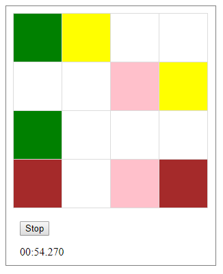

Игра “Найди пару”.
 
Страница содержит игровое поле размером 4 на 4 квадрата, кнопку "Играть" и таймер.

В начале игры все квадраты окрашены в белый цвет.

После нажатия на кнопку "старт", для 16 квадратов случайно генерируются 8 пар различных цветов. 
Таймер начинает отсчёт.

Когда игрок нажимает на одну из клеток, она окрашивается в определенный цвет. 
Суть игры - открыть 2 клетки одного цвета.
После нажатия на клетку (если цвета у клеток совпали) - цвета никуда не продают, 
если же вы ошиблись, то оба квадрата окрашиваются обратно в белый.

Можно остановить игру нажав на кнопку Stop, но тогда появится всплывающее окно с сообщением о поражении.

Цель игры - найти всем клеткам пары, тем самым полностью раскрасив игровое поле.
После нахождения последней пары таймер останавливается и появляется 
всплывающее окно с информацией об окончании игры и временем затраченном на неё.

Игровое поле по завершении игры:

Всплывающее окно:

